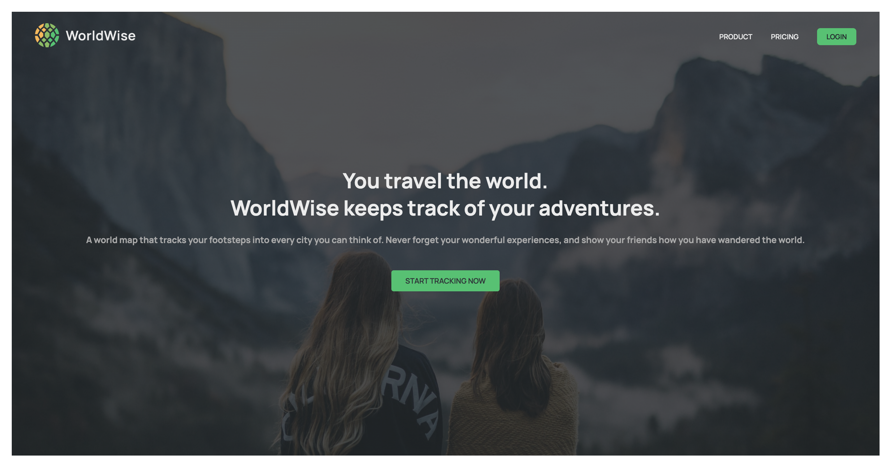
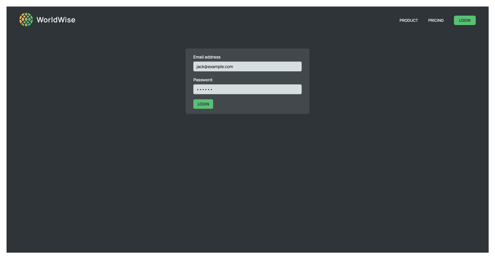

# WorldWise tracks the adventures - build with React + Vite

This is a exercise to build WorldWise website with React & React Component Libraries. The user tracks their adventures on the map, write down some memo for cities.

- Screenshot:
  
  
  

## Built with

- React
- React Router
- React Leaflet & Leaflet
- React Datepicker
- CSS Modules

### Install React Router & React Leaflet & Leaflet & React Datepicker

```Shell
npm i react-router-dom react-leaflet leaflet react-datepicker
```

## Use json-server to simulate APIs request

- Install

```Shell
npm install json-server
```

- Script setting

```JSON
"server": "json-server --watch data/cities.json --port 8000 --delay 500"
```

- Run the server

```Shell
npm run server
```

## Run the app

- Runs the app in the development mode.

```Shell
npm run dev
```

## Author

- The Ultimate React Course 2024: React, Redux & More by Jonas Schmedtmann
- YAL
